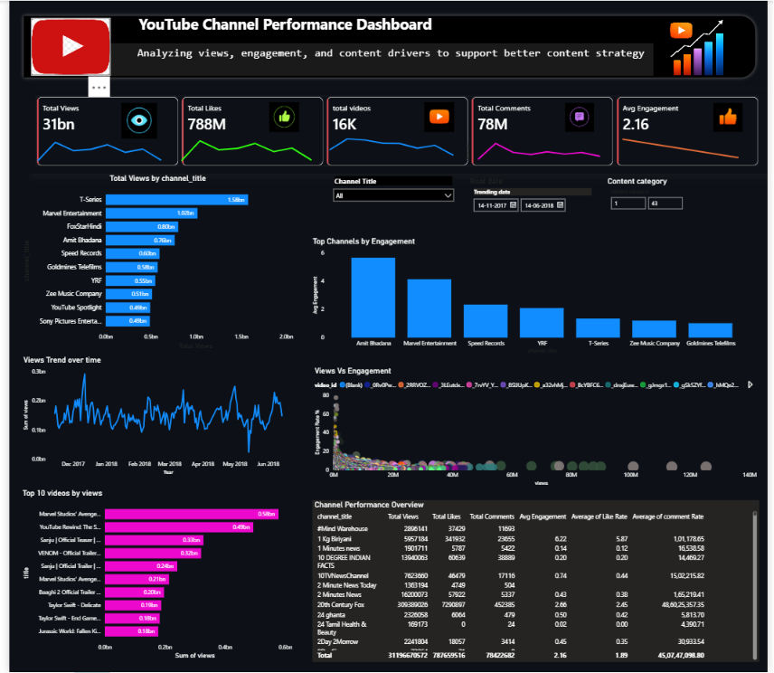

# 📊 YouTube Trending Videos Analysis

> An end-to-end Data Analytics project that explores YouTube trending videos using **Python, PostgreSQL, and Power BI** to uncover patterns in audience engagement, content performance, and channel dominance.

---

## 📌 Project Overview

YouTube receives millions of video uploads every day, yet only a small percentage appear on the Trending page. This project analyzes trending video data to identify the factors that contribute to a video's success.

The analysis combines **data cleaning, SQL querying, exploratory data analysis (EDA), interactive dashboard development, and business storytelling** to transform raw data into actionable insights.

---

# 📸 Dashboard Preview




---

## 🎯 Business Problem

Content creators and digital marketing teams often struggle to understand:

- Which content categories attract the highest audience?
- Which channels consistently dominate YouTube Trending?
- Does a higher number of views always lead to better engagement?
- Which metrics best represent content success?

This project answers these questions through data-driven analysis.

---

## 🛠️ Tech Stack

| Tool | Purpose |
|------|----------|
| Python | Data Cleaning & Exploratory Data Analysis |
| Pandas | Data Manipulation |
| Matplotlib | Data Visualization |
| PostgreSQL | Business Query Analysis |
| Power BI | Interactive Dashboard |
| Jupyter Notebook | Analysis & Documentation |

---

## 📂 Dataset

The dataset contains information about YouTube trending videos including:

- Video Title
- Channel Name
- Category
- Views
- Likes
- Comments
- Publish Date
- Trending Date

---

## 📈 Project Workflow

```
Raw Dataset
      │
      ▼
Data Cleaning (Python)
      │
      ▼
Exploratory Data Analysis
      │
      ▼
Business Analysis (SQL)
      │
      ▼
Power BI Dashboard
      │
      ▼
Business Insights & Recommendations
```

---

## 📊 Dashboard Features

The Power BI dashboard provides insights into:

- Total Views
- Total Likes
- Total Comments
- Engagement Rate
- Top Performing Channels
- Category-wise Performance
- Top Trending Videos
- Views vs Likes Relationship
- Engagement Distribution

---

## 🔍 Key Business Insights

### Channel Dominance

A small number of channels consistently capture the majority of trending views, indicating strong audience loyalty and brand recognition.

### Category Performance

Entertainment content contributes the largest share of trending videos and total audience reach.

### Audience Engagement

While views and likes exhibit a strong positive relationship, videos with exceptionally high views do not always achieve the highest engagement rates.

### Content Quality

Engagement Rate serves as a stronger indicator of audience interaction than view count alone.

---

## 💼 Business Recommendations

- Monitor engagement metrics alongside total views.
- Collaborate with consistently trending creators.
- Focus on high-performing content categories.
- Measure campaign success using engagement rate instead of views alone.
- Encourage audience interaction through comments and likes.

---


## 🚀 How to Run

1. Clone the repository.

```
git clone https://github.com/yourusername/YouTube-Trending-Analysis.git
```

2. Open the Jupyter Notebook.

3. Execute the Python notebook for data cleaning and EDA.

4. Import the cleaned dataset into PostgreSQL.

5. Execute the SQL queries.

6. Open the Power BI dashboard to explore interactive insights.

---

## 📚 Skills Demonstrated

- Data Cleaning
- Data Wrangling
- SQL
- Exploratory Data Analysis
- Data Visualization
- Dashboard Development
- Business Intelligence
- Business Storytelling

---

## 👨‍💻 Author

**Sunny Verma**

Data Analyst | SQL | Python | Power BI | Excel
